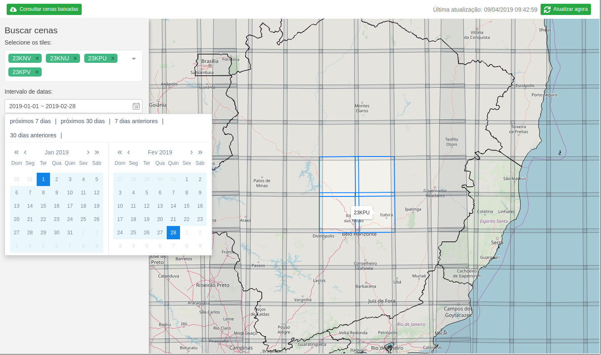
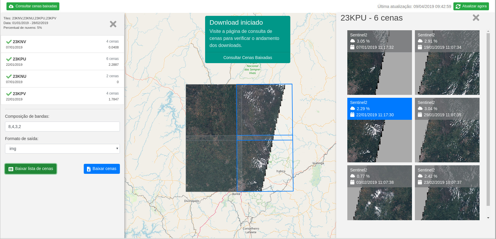

# Sentinel web image downloader

A personal project for previewing, selecting and downloading Sentinel-2 satellite imagery made with **Node.js**, **MongoDB**, **Vue.js** and **Docker**.

The imagery metadata acquired from GoogleCloud is stored in Mongo and can be queried and downloaded through the Vue interface.

_This project is not production ready and has been developed for learning and personal use (the code and interface are in Portuguese)._

## Some prints

Initial screen and scene selection. Path/rows can be selected via dropdown or via map.

The best scenes for each path/row can be previewed. You can also select the band composition you want to download.

### Running:

 - frontend folder: `npm run serve`
 - root folder: `sudo docker-compose build; sudo docker-compose up`

### Troubleshooting
 - DNS problems: https://development.robinwinslow.uk/2016/06/23/fix-docker-networking-dns/